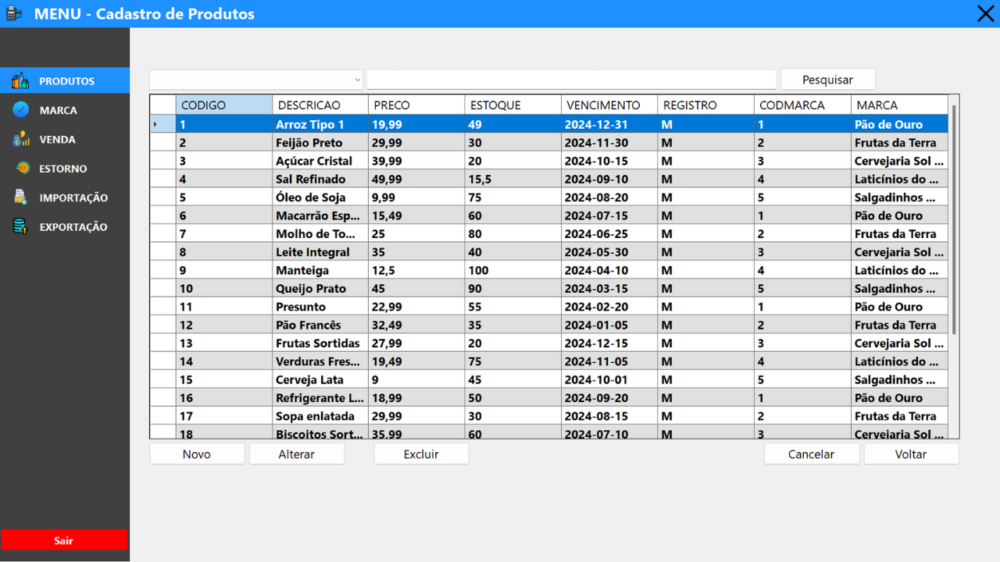
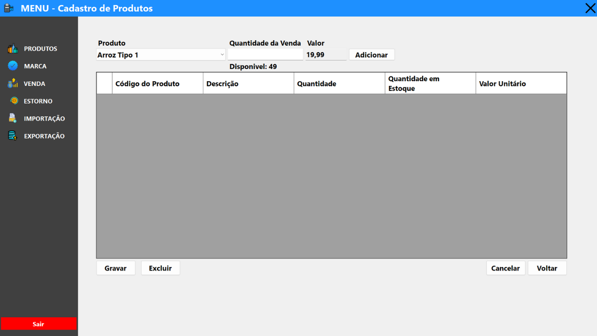
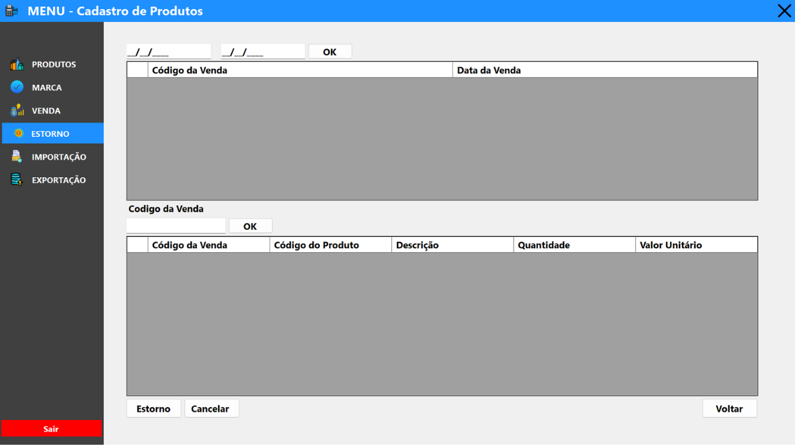
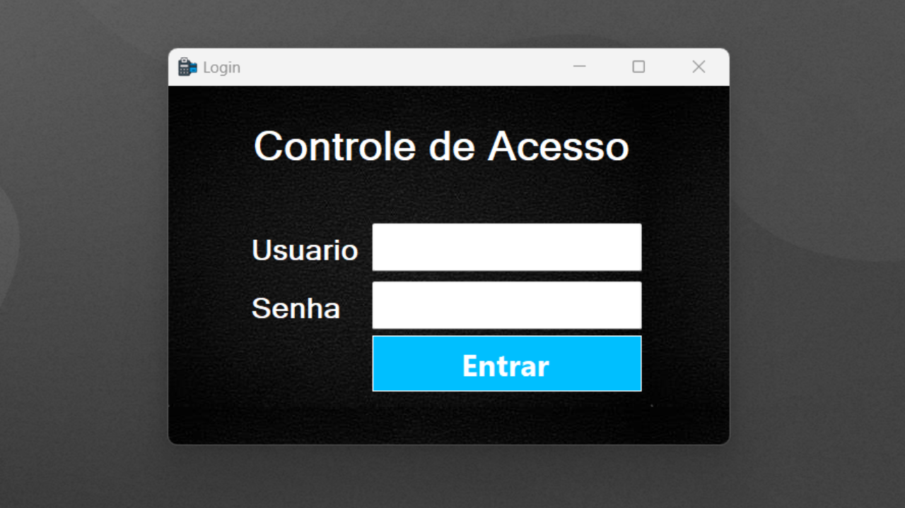

# 🎯 Sistema de Gestão de Vendas com Estorno e Controle de Produtos


---

## 📋 Sobre o projeto

Sistema completo de **gestão de vendas** desenvolvido em **C# com Windows Forms** e **SQLite**, com foco no controle de produtos, vendas, estornos, importação/exportação de dados e cadastro de marcas.

---

## 🖼️ Imagens do Sistema

### 🏠 Menu Principal


### 🛒 Cadastro de Produtos


### 💰 Venda de Produtos


### ↩️ Estorno de Vendas


### 🔐 Tela de Login


---

## 🔧 Funcionalidades Principais

✅ Menu principal com navegação dinâmica entre formulários, evitando múltiplas instâncias  
✅ Estrutura modular em camadas: **DTO**, **DAL** e **BLL**  
✅ Persistência local de dados utilizando **SQLite**  
✅ Módulos independentes para:  
- Cadastro e pesquisa de **Produtos** e **Marcas**  
- Processamento de **Vendas** e **Estornos**  
- **Importação** e **Exportação** de arquivos  
- Tela de **Login** com autenticação de usuários  

---

## 🧠 Destaques Técnicos

- Utilização de **Generics com constraints** (`where T : Form, new()`) para abertura dinâmica de formulários  
- Gerenciamento de janelas aninhadas via **DockStyle.Fill** para uma interface limpa e intuitiva  
- Organização seguindo princípios de **Clean Code** e **SOLID**  

---

## 💻 Tecnologias Utilizadas

- **C#** (.NET Framework)
- **Windows Forms**
- **SQLite** (`System.Data.SQLite`)
- Arquitetura em **Camadas** (DTO, DAL, BLL)

---

## 📁 Estrutura do Projeto

```plaintext
📂 PrjVendaEstorno
 ├── 📂 code
 ├── 📂 Resources
 ├── frmCadastroMarca.cs
 ├── frmCadastroProdutos.cs
 ├── frmEstorno.cs
 ├── frmExportarArquivo.cs
 ├── frmImportarArquivo.cs
 ├── frmLogin.cs
 ├── frmMenu.cs
 ├── frmPesquisaMarca.cs
 ├── frmPesquisaProdutos.cs
 ├── frmVenda.cs
 ├── Program.cs
 └── SistemaVendas.ico
